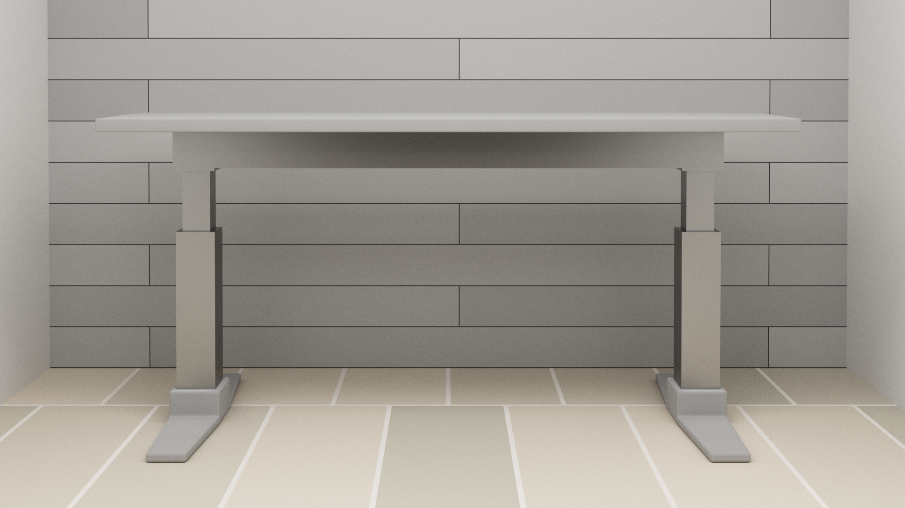

# Fig Table

[![License][license-img]][license-url]
[![Donate][donate-img]][donate-url]

A repository with everything involved in the design and engineering of the Fig Table. This includes:

- **Server** - A Rust HTTP server 
- **Client** - A Node.js CLI tool that you can easily send requests to the table from.
- **CAD** - 3D model schematics for the outer table design.

| Product | Store | Cost |
|---------|-------|------|
| Raspberry Pi 3 B+ w/ PSU | [Amazon](https://www.amazon.com/gp/product/B01C6FFNY4/ref=oh_aui_search_detailpage?ie=UTF8&psc=1) | $46.99 |
| 32 GB Micro SD Card | [Amazon](https://www.amazon.com/gp/product/B010Q57T02/ref=od_aui_detailpages00?ie=UTF8&psc=1) | $10.59 |
| Relay Board | [Amazon](https://www.amazon.com/JBtek-Channel-Module-Arduino-Raspberry/dp/B00KTEN3TM/ref=sr_1_3?ie=UTF8&qid=1487462388&sr=8-3&keywords=relay+raspberry+pi) | $7.59 |
| Female to Female GPIO Cables (40) | [Amazon](https://www.amazon.com/gp/product/B00KOL5BCC/ref=oh_aui_detailpage_o09_s00?ie=UTF8&psc=1) | $4.99 |
| DC Power Pigtails (10) | [Amazon](https://www.amazon.com/gp/product/B00CUKHN0S/ref=oh_aui_detailpage_o00_s00?ie=UTF8&psc=1) | $5.28 |
| 12V 10A Power Supply | [Amazon](https://www.amazon.com/gp/product/B00Z9X4GLW/ref=oh_aui_detailpage_o00_s01?ie=UTF8&psc=1) | $15.47 |
| 2x Linear Actuators | [Ebay](http://www.ebay.com/itm/122042491329?_trksid=p2060353.m2749.l2649&ssPageName=STRK%3AMEBIDX%3AIT) | $94.27 |
| 8' x 12" x 1" Plywood | [Lowes]https://www.lowes.com/pd/Top-Choice-Blondewood-1-2-in-Whitewood-Plywood-Application-as-4-x-8/50121137) | $36.98 |
| Wood Glue | [Home Depot](https://www.homedepot.com/p/Gorilla-8-fl-oz-Wood-Glue-62000/100672167) | $4.47 |
| Gray Stain | [Home Depot](https://www.homedepot.com/p/Varathane-1-qt-3X-Weathered-Gray-Premium-Wood-Stain-Case-of-2-267124/203377037) | $15.54 |
| Wood Satin Lacquer | [Home Depot](https://www.homedepot.com/p/Minwax-1-qt-Clear-Satin-Fast-Drying-Polyurethane-Interior-Wood-Protective-Finish-63010/100201939) | $10.77 |
| Aluminum 6063 Square Tube 4' x 6" X 6" X .125"  | [Metal Supermarkets](https://www.metalsupermarkets.com/metals/aluminum/aluminum-6061-square-tube/) | $60.00 |
| Aluminum 6063 Square Tube 6' x 6" X 3" X .125"  | [Metal Supermarkets](https://www.metalsupermarkets.com/metals/aluminum/aluminum-6061-square-tube/) | $45.00 |
| Aluminum 6063 Square Tube 4' x 4" X 4" X .125"  | [Metal Supermarkets](https://www.metalsupermarkets.com/metals/aluminum/aluminum-6061-square-tube/) | $26.66 |

| Total | w/o tax | **383.94** | 

## Security

For security reasons your Pi should be set up with a firewall to only allow for requests from web ports:

```bash
sudo apt-get install ufw
ufw allow 80
ufw enable
```

## Server

The application that runs on the Raspberry Pi 3 B+, creates an HTTP server at port `3007` that a client can POST to.

- `/api` - POST API endpoint, you send the following schema.

```ts
type APIRequest = {
  // float that describes direction of the table.
  direction: number
  // milliseconds to perform action
  time: number
}
```

### Compiling

Instructions come from [this guide](https://github.com/japaric/rust-cross).

```bash
# Step 1: Install the C cross toolchain
sudo apt-get install -qq gcc-arm-linux-gnueabihf

# Step 2: Install the cross compiled standard crates
rustup target add armv7-unknown-linux-gnueabihf

# Step 3: Configure cargo for cross compilation
mkdir -p ~/.cargo
cat >>~/.cargo/config <<EOF\n[target.armv7-unknown-linux-gnueabihf]\nlinker = "arm-linux-gnueabihf-gcc"EOF

# Step 4: Build
cargo build --target=armv7-unknown-linux-gnueabihf
```

### Deploying

Wire your Pi as follows:

| Physical Pin | Description | Motor Controller |
|--------------|-------------|------------------|
| 31 | GPIO 6  | Actuator 1 Up |
| 33 | GPIO 13 | Actuator 1 Down |
| 35 | GPIO 19 | Actuator 2 Up |
| 37 | GPIO 26 | Actuator 2 Down |
| 2 | - | 5V |
| 39 | - | GND |

Install Raspian lite, and configure it for your keyboard/country since by default it's set to the UK. 

Then `cd` to the standing desk server distribution.

```bash
# Download the server
wget https://github.com/alaingalvan/fig-standing-desk/raw/master/server/dist/fig-table-server

# Configure either iptables or an nginx reverse proxy
sudo iptables -t nat -A OUTPUT -o lo -p tcp --dport 80 -j REDIRECT --to-port 3007

# Run the server as root.
sudo ./fig-table-server

# Create a service that includes the server.
cat >>/etc/init/table-server.conf <<EOF\n exec ~/fig-standing-desk/fig-table-server EOF
sudo ln -s /etc/init/table-server.conf /etc/init.d/table-server
sudo service table-server start
```

## Client


A CLI application that's meant to be installed as a global module on node. 

```bash
git clone git@github.com:alaingalvan/fig-standing-desk.git
npm i client -g
```

```
🍐 fig-table Node.js CLI

Usage:
    fig-table <number>            Move table up by x centimeters
    fig-table [options]

Options:
    -h, --help                    Display this message
    -v, --version                 Print version info and exit
    -c, --config <ip-address>     Configure the app with a unique ip.
```

## CAD

Blender files used to design and CNC the table.

[license-img]: http://img.shields.io/:license-lgpl3-blue.svg?style=flat-square
[license-url]: https://opensource.org/licenses/lgpl-3.0.html
[donate-img]: https://img.shields.io/badge/$-support-green.svg?style=flat-square
[donate-url]: https://www.paypal.me/alaingalvan/3
